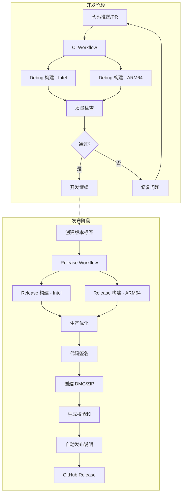

# QuickLauncher GitHub CI/CD 配置完成总结

## 🎉 配置概述

已成功为 QuickLauncher 项目配置了完整的 GitHub Actions CI/CD 流程，支持多架构构建和自动发布。

## 📁 创建的文件

### 1. GitHub Actions 工作流
- **`.github/workflows/ci.yml`** - 持续集成配置
- **`.github/workflows/release.yml`** - 自动发布配置
- **`.github/README.md`** - CI/CD 使用说明

### 2. 辅助脚本
- **`scripts/create-simple-dmg.sh`** - DMG 安装包创建脚本
- **`scripts/test-ci-build.sh`** - CI 构建测试脚本

### 3. 配置更新
- **`.gitignore`** - 更新以包含构建产物和临时文件

## 🚀 功能特性

### CI 流程 (`ci.yml`)
- ✅ **多架构支持**：Intel x86_64 和 Apple Silicon ARM64
- ✅ **兼容性测试**：macOS 10.15+ (Intel) 和 macOS 11.0+ (ARM64)
- ✅ **代码检查**：基本语法和结构验证
- ✅ **缓存优化**：Swift Package Manager 和构建缓存
- ✅ **权限检查**：脚本可执行权限验证
- ✅ **完整应用包**：包含资源文件、本地化、图标等完整组件
- ✅ **代码签名**：自签名确保 macOS 兼容性和可启动性
- ✅ **完整性验证**：全面的 bundle 结构和签名验证

### 发布流程 (`release.yml`)
- ✅ **自动构建**：Intel 和 ARM64 版本
- ✅ **多格式发布**：DMG 安装包和 ZIP 压缩包
- ✅ **代码签名**：自签名或开发者证书支持
- ✅ **校验和**：SHA256 文件完整性校验
- ✅ **自动发布说明**：详细的安装和使用说明

## 📦 发布产物

每次自动发布会生成：

| 文件类型 | Intel 版本 | Apple Silicon 版本 | 用途 |
|---------|-----------|------------------|------|
| **DMG** | `QuickLauncher-Intel.dmg` | `QuickLauncher-ARM64.dmg` | 推荐的安装包 |
| **ZIP** | `QuickLauncher-Intel.zip` | `QuickLauncher-ARM64.zip` | 备用压缩包 |
| **校验和** | `*.sha256` | `*.sha256` | 文件完整性验证 |

## 🎯 CI/CD 工作流设计理念

### 为什么需要两个独立的工作流？

QuickLauncher 项目采用了分离式的 CI/CD 设计，包含 **CI Workflow** 和 **Release Workflow** 两个独立但协作的工作流，这是现代软件开发的最佳实践。

### 🧪 CI Workflow (`.github/workflows/ci.yml`)

**核心目的**: 持续集成和代码质量保证

```yaml
触发条件:
  push:
    branches: [ main, master, develop ]  # 每次代码推送都验证
  pull_request:
    branches: [ main, master, develop ]  # 每次 PR 都检查
```

**主要职责**:
- ✅ **快速验证**: 每次 code change 都验证构建是否正常
- ✅ **多架构测试**: 同时测试 Intel x86_64 和 Apple Silicon ARM64 构建
- ✅ **早期发现问题**: PR 阶段就能发现构建问题，避免集成地狱
- ✅ **代码质量检查**: SwiftLint、语法检查、项目结构验证
- ✅ **临时构建产物**: 7天有效期的 CI artifacts，仅用于验证

**设计特点**:
- 🏃 **快速反馈**: Debug 配置，构建速度快
- 💰 **成本优化**: 临时存储，节省 Actions 费用
- 🔍 **开发工具**: 专注于开发者体验

### 🚀 Release Workflow (`.github/workflows/release.yml`)

**核心目的**: 生产版本发布和用户交付

触发条件:
```yaml
  push:
    tags:
      - 'v*'  # 只有推送版本标签时才触发正式发布
```

**主要职责**:
- 📦 **生产构建**: 优化的 Release 配置，性能最佳
- 🏷️ **版本管理**: 自动创建 GitHub Release 和版本说明
- 📋 **完整文档**: 详细的安装说明、使用指南、更新日志
- 🔐 **代码签名**: 自签名或开发者证书，提升用户信任度
- 📦 **多种格式**: DMG 安装包、ZIP 压缩包，满足不同用户需求
- 🔐 **安全校验**: SHA256 文件完整性验证
- 🌐 **永久存储**: 长期保存，用户随时可下载

**设计特点**:
- ⭐ **用户导向**: 用户体验优先
- 🛡️ **质量保证**: 完整的测试和验证流程
- 📚 **文档完整**: 自动生成专业的发布说明

### 📊 对比分析

| 特性维度 | CI Workflow | Release Workflow |
|----------|-------------|------------------|
| **触发频率** | 高频（每次推送） | 低频（版本发布） |
| **构建配置** | Debug（快速验证） | Release（性能优化） |
| **产物存储** | 7天临时 | 永久发布 |
| **文件格式** | .app 包（验证用） | DMG + ZIP + 校验和 |
| **代码签名** | 无 | 自签名/开发者证书 |
| **版本说明** | 无 | 完整发布说明 |
| **目标用户** | 开发者 | 最终用户 |
| **主要目的** | 开发效率 | 交付质量 |

### 🎯 实际工作流程

#### 日常开发场景:
```bash
# 开发新功能
git add .
git commit -m "feat: 添加快捷键支持"
git push origin feature-branch
# → CI Workflow 自动运行 → 验证构建 → 如果失败，立即修复
```

#### 发布版本场景:
```bash
# 准备发布
git checkout main
git merge feature-branch
git tag v1.0.0
git push origin v1.0.0  
# → Release Workflow 运行 → 创建正式发布文件 → 用户可下载
```

### 💡 设计优势

1. **效率与质量平衡**:
   - CI: 快速迭代，不阻塞开发
   - Release: 精益求精，确保用户获得最佳体验

2. **成本优化策略**:
   - CI: 轻量级验证，节省计算资源
   - Release: 完整构建，值得投入成本

3. **风险隔离**:
   - CI 问题影响开发，不影响用户
   - Release 问题经过充分验证，风险极低

4. **专业化分工**:
   - CI: 面向开发者，注重技术细节
   - Release: 面向用户，注重使用体验

5. **可维护性**:
   - 独立配置，易于调试和修改
   - 清晰的职责边界，减少复杂性

这种双工作流设计确保了开发效率和发布质量的完美平衡，是现代 macOS 应用项目推荐的 CI/CD 架构模式。

## 🔧 构建要求

### 系统兼容性
- **Intel 版本**：macOS 10.15 (Catalina)+
- **Apple Silicon**：macOS 11.0 (Big Sur)+
- **最低 Xcode**：支持 Swift 5.3+ 的版本

### 构建环境
- **CI 环境**：macOS-14 (GitHub Actions)
- **本地测试**：支持 Intel 和 Apple Silicon Mac

## 📋 使用方法

### 1. 开发阶段 (CI Workflow)
```bash
# 本地测试构建（模拟 CI 流程）
./scripts/test-ci-build.sh

# 更新图标和资源
./scripts/update_app_icons.sh Resources/app-icon.png Resources/status-icon.png

# 日常开发 - 推送代码自动触发 CI 验证
git add .
git commit -m "feat: 添加快捷键支持"
git push origin feature-branch
# → CI Workflow 自动运行 → 验证构建 → 获得快速反馈

# 创建 PR 进一步验证代码质量
# → CI Workflow 在 PR 上运行 → 确保集成无问题
```

### 2. 发布阶段 (Release Workflow)
```bash
# 准备发布版本
git checkout main
git merge feature-branch
git tag v1.0.0  # 创建版本标签
git push origin v1.0.0
# → Release Workflow 自动运行 → 创建正式发布文件

# 发布包含：
# - Intel 和 ARM64 版本（DMG + ZIP）
# - SHA256 校验和文件
# - 完整的版本说明和安装指南
# - 代码签名（自签名或开发者证书）
```

## 🔐 代码签名配置

### 自签名（默认）
- 自动应用临时自签名
- 用户首次运行需手动允许
- 适合开发和测试

### 开发者证书（可选）
1. 在 GitHub Secrets 中设置 `APPLE_SIGNING_IDENTITY`
2. 格式：`Developer ID Application: Your Name (TEAM_ID)`
3. CI 自动使用开发者证书签名

## 🎨 图标管理

使用更新的图标管理工具：
```bash
# 分别设置应用图标和状态栏图标
./scripts/update_app_icons.sh Resources/app-icon.png Resources/status-icon.png

# 使用相同图标
./scripts/update_app_icons.sh Resources/app-icon.png
```

## 📊 监控和调试

### CI 状态查看
- **GitHub Actions 页面**：查看构建状态和日志
- **构建日志**：详细的编译过程和错误信息
- **发布历史**：GitHub Releases 页面

### 本地调试
```bash
# 完整的本地测试
./scripts/test-ci-build.sh

# 单独测试构建
xcodebuild -project QuickLauncher.xcodeproj -scheme QuickLauncher \
  -configuration Debug -arch x86_64 \
  CODE_SIGN_IDENTITY="" CODE_SIGNING_REQUIRED=NO \
  -allowProvisioningUpdates clean build
```

## 🔄 工作流程



## 🛠️ 故障排除

### 常见问题

1. **构建失败**
   - 检查 Xcode 版本兼容性
   - 验证项目配置和依赖
   - 查看详细的构建日志

2. **发布失败**
   - 确认标签格式正确（`v` 开头）
   - 检查 GITHUB_TOKEN 权限
   - 验证 GitHub Actions 配置

3. **签名问题**
   - 检查开发者证书配置
   - 验证 Apple ID 和 Team ID
   - 确认证书有效期

4. **"应用已损坏或不完整" (CI Build Issue)**
   - **原因**: CI 构建缺少必要的资源文件和代码签名
   - **解决方案**: CI workflow 已修复，现在包含：
     - ✅ 完整的资源文件复制（Assets.xcassets、本地化文件）
     - ✅ 自签名确保 macOS 兼容性
     - ✅ 完整性验证和结构检查
   - **验证方法**: 
     ```bash
     # 检查 app bundle 完整性
     codesign --verify --verbose QuickLauncher-Intel.app
     
     # 检查资源文件
     ls -la QuickLauncher-Intel.app/Contents/Resources/
     
     # 检查签名状态
     spctl -a -vv QuickLauncher-Intel.app
     ```

### 调试命令

```bash
# 验证 GitHub Actions 配置
python3 -c "import yaml; yaml.safe_load(open('.github/workflows/ci.yml'))"

# 测试脚本语法
bash -n scripts/*.sh

# 检查项目配置
xcodebuild -list -project QuickLauncher.xcodeproj
```

## 📈 性能优化

### 缓存策略
- Swift Package Manager 依赖缓存
- Xcode DerivedData 缓存
- 本地依赖项缓存

### 构建优化
- 并行构建多架构
- 增量构建支持
- 依赖项预编译

## 🔮 未来改进

- [ ] 添加自动版本号管理
- [ ] 集成自动化测试
- [ ] 添加 Slack/Discord 通知
- [ ] 支持自动 Changelog 生成
- [ ] 集成依赖更新检查

---

**🎉 配置完成！项目现在具备完整的 CI/CD 流程，支持自动构建、测试和发布。**