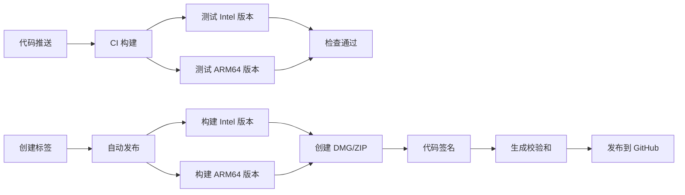

# QuickLauncher GitHub CI/CD 配置完成总结

## 🎉 配置概述

已成功为 QuickLauncher 项目配置了完整的 GitHub Actions CI/CD 流程，支持多架构构建和自动发布。

## 📁 创建的文件

### 1. GitHub Actions 工作流
- **`.github/workflows/ci.yml`** - 持续集成配置
- **`.github/workflows/release.yml`** - 自动发布配置
- **`.github/README.md`** - CI/CD 使用说明

### 2. 辅助脚本
- **`scripts/create-simple-dmg.sh`** - DMG 安装包创建脚本
- **`scripts/test-ci-build.sh`** - CI 构建测试脚本

### 3. 配置更新
- **`.gitignore`** - 更新以包含构建产物和临时文件

## 🚀 功能特性

### CI 流程 (`ci.yml`)
- ✅ **多架构支持**：Intel x86_64 和 Apple Silicon ARM64
- ✅ **兼容性测试**：macOS 10.15+ (Intel) 和 macOS 11.0+ (ARM64)
- ✅ **代码检查**：基本语法和结构验证
- ✅ **缓存优化**：Swift Package Manager 和构建缓存
- ✅ **权限检查**：脚本可执行权限验证

### 发布流程 (`release.yml`)
- ✅ **自动构建**：Intel 和 ARM64 版本
- ✅ **多格式发布**：DMG 安装包和 ZIP 压缩包
- ✅ **代码签名**：自签名或开发者证书支持
- ✅ **校验和**：SHA256 文件完整性校验
- ✅ **自动发布说明**：详细的安装和使用说明

## 📦 发布产物

每次自动发布会生成：

| 文件类型 | Intel 版本 | Apple Silicon 版本 | 用途 |
|---------|-----------|------------------|------|
| **DMG** | `QuickLauncher-Intel.dmg` | `QuickLauncher-ARM64.dmg` | 推荐的安装包 |
| **ZIP** | `QuickLauncher-Intel.zip` | `QuickLauncher-ARM64.zip` | 备用压缩包 |
| **校验和** | `*.sha256` | `*.sha256` | 文件完整性验证 |

## 🔧 构建要求

### 系统兼容性
- **Intel 版本**：macOS 10.15 (Catalina)+
- **Apple Silicon**：macOS 11.0 (Big Sur)+
- **最低 Xcode**：支持 Swift 5.3+ 的版本

### 构建环境
- **CI 环境**：macOS-14 (GitHub Actions)
- **本地测试**：支持 Intel 和 Apple Silicon Mac

## 📋 使用方法

### 1. 开发阶段
```bash
# 本地测试构建
./scripts/test-ci-build.sh

# 更新图标
./scripts/update_app_icons.sh Resources/app-icon.png Resources/status-icon.png
```

### 2. 触发 CI
```bash
# 推送代码触发 CI
git add .
git commit -m "feat: 添加新功能"
git push origin main
```

### 3. 创建发布
```bash
# 创建版本标签触发自动发布
git tag v1.0.0
git push origin v1.0.0
```

## 🔐 代码签名配置

### 自签名（默认）
- 自动应用临时自签名
- 用户首次运行需手动允许
- 适合开发和测试

### 开发者证书（可选）
1. 在 GitHub Secrets 中设置 `APPLE_SIGNING_IDENTITY`
2. 格式：`Developer ID Application: Your Name (TEAM_ID)`
3. CI 自动使用开发者证书签名

## 🎨 图标管理

使用更新的图标管理工具：
```bash
# 分别设置应用图标和状态栏图标
./scripts/update_app_icons.sh Resources/app-icon.png Resources/status-icon.png

# 使用相同图标
./scripts/update_app_icons.sh Resources/app-icon.png
```

## 📊 监控和调试

### CI 状态查看
- **GitHub Actions 页面**：查看构建状态和日志
- **构建日志**：详细的编译过程和错误信息
- **发布历史**：GitHub Releases 页面

### 本地调试
```bash
# 完整的本地测试
./scripts/test-ci-build.sh

# 单独测试构建
xcodebuild -project QuickLauncher.xcodeproj -scheme QuickLauncher \
  -configuration Debug -arch x86_64 \
  CODE_SIGN_IDENTITY="" CODE_SIGNING_REQUIRED=NO \
  -allowProvisioningUpdates clean build
```

## 🔄 工作流程



## 🛠️ 故障排除

### 常见问题

1. **构建失败**
   - 检查 Xcode 版本兼容性
   - 验证项目配置和依赖
   - 查看详细的构建日志

2. **发布失败**
   - 确认标签格式正确（`v` 开头）
   - 检查 GITHUB_TOKEN 权限
   - 验证 GitHub Actions 配置

3. **签名问题**
   - 检查开发者证书配置
   - 验证 Apple ID 和 Team ID
   - 确认证书有效期

### 调试命令

```bash
# 验证 GitHub Actions 配置
python3 -c "import yaml; yaml.safe_load(open('.github/workflows/ci.yml'))"

# 测试脚本语法
bash -n scripts/*.sh

# 检查项目配置
xcodebuild -list -project QuickLauncher.xcodeproj
```

## 📈 性能优化

### 缓存策略
- Swift Package Manager 依赖缓存
- Xcode DerivedData 缓存
- 本地依赖项缓存

### 构建优化
- 并行构建多架构
- 增量构建支持
- 依赖项预编译

## 🔮 未来改进

- [ ] 添加自动版本号管理
- [ ] 集成自动化测试
- [ ] 添加 Slack/Discord 通知
- [ ] 支持自动 Changelog 生成
- [ ] 集成依赖更新检查

---

**🎉 配置完成！项目现在具备完整的 CI/CD 流程，支持自动构建、测试和发布。**